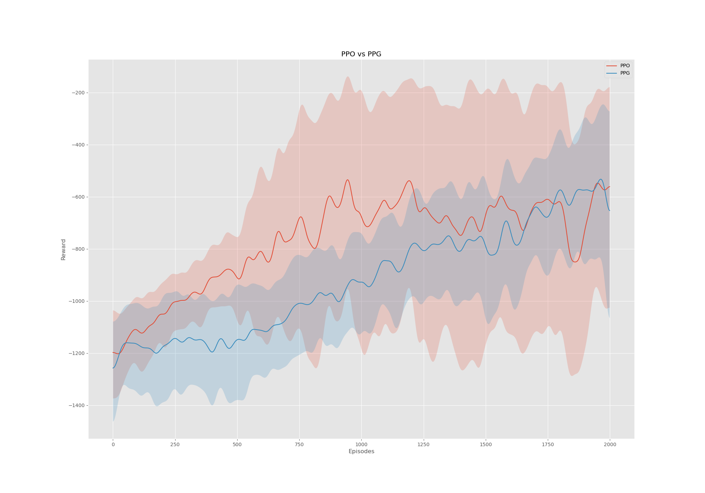

## On Policy 

Welcome to the On Policy repo, a repo with raw RL implementations. No mutliprocessing, no complex boilerplate code, only the raw, brutal, crude implementation so that we understand a little of what is going on. Of course, the drawback is that it might require a little reformating to make this compatible with a super-duper scalable architecture. 

### PPG vs PPO

Added an implementation and comparison plot for PPO vs the new PPG ([Phasic Policy Gradients](https://arxiv.org/pdf/2009.04416.pdf)), which is a PPO agent with an additionnal value head on the policy network that allows to have an auxiliary loss function to help align the states comprehension 

